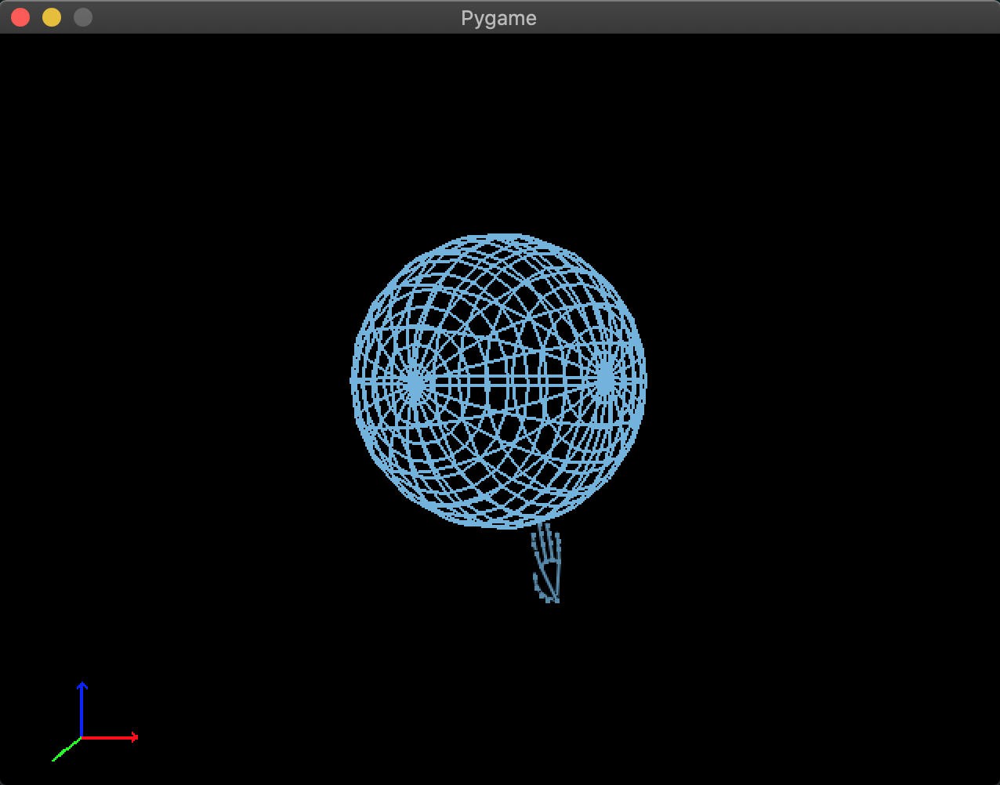

# 3D Hand Interaction with Pygame, OpenGL, and Mediapipe

This project demonstrates interactive 3D modeling using hand gestures. The application utilizes Pygame, OpenGL, and the Mediapipe library to track hand movements and translate them into actions within a 3D environment. Started the project as an introduction into 3d enviorments :D.

## Features

- 3D modeling of shapes (cube, sphere, cone, and teapot) based on hand gestures.
- Real-time hand tracking using Mediapipe to capture hand landmarks.
- Calibration for initial hand position and scaling.
- Smooth transitions for hand movements and scaling adjustments.
- Visualization of hand skeleton in the 3D environment.
- Selection of shapes using keyboard input.



## Requirements

- Python 3.X
- OpenCV (`cv2`)
- Pygame
- Mediapipe
- OpenGL (`OpenGL.GL`, `OpenGL.GLUT`, `OpenGL.GLU`)

## Installation

1. Clone the repository:

    ```bash
    git clone https://github.com/generalghost890/render-manipulation.git

    cd render-manipulation
    ```

2. Install the required dependencies:

    ```bash
    pip install -r requirements.txt
    ```

## Usage

1. Run the application:

    ```bash
    python3 main.py
    ```

2. Use hand gestures to interact with the 3D environment:
   - Single hand: Control position and rotation.
   - Two hands: Control scaling and rotation.

3. Use the keyboard to switch between different shapes:
   - Press `1` for a cube.
   - Press `2` for a sphere.
   - Press `3` for a cone.
   - Press `4` for a Diamond.

## Controls

- **Single Hand:**
  - Move hand to control position.

- **Two Hands:**
  - Move hands horizontally to adjust size.
  - Move both hands vertically to control rotation.

- **Keyboard:**
  - Press `1`, `2`, `3`, or `4` to select different shapes.

## Notes

- Custom shapes can be added by downloading an obj file less than 1k vertices reccomended(preformance issues if above) and rename the diamond.obj in the py file. 
- Calibration is automatically performed when a single hand is detected near the center of the screen.
- Smooth transitions and scaling adjustments are applied.
- The code supports the visualization of a hand skeleton.

## Acknowledgments

- [Mediapipe](https://mediapipe.dev/) for hand tracking.
- [Pygame](https://www.pygame.org/) for the Visualisation development framework.
- [OpenGL](https://www.opengl.org/) for 3D rendering.

## License

This project is licensed under the GNU GENERAL PUBLIC LICENSE - see the [LICENSE](LICENSE) file for details.
